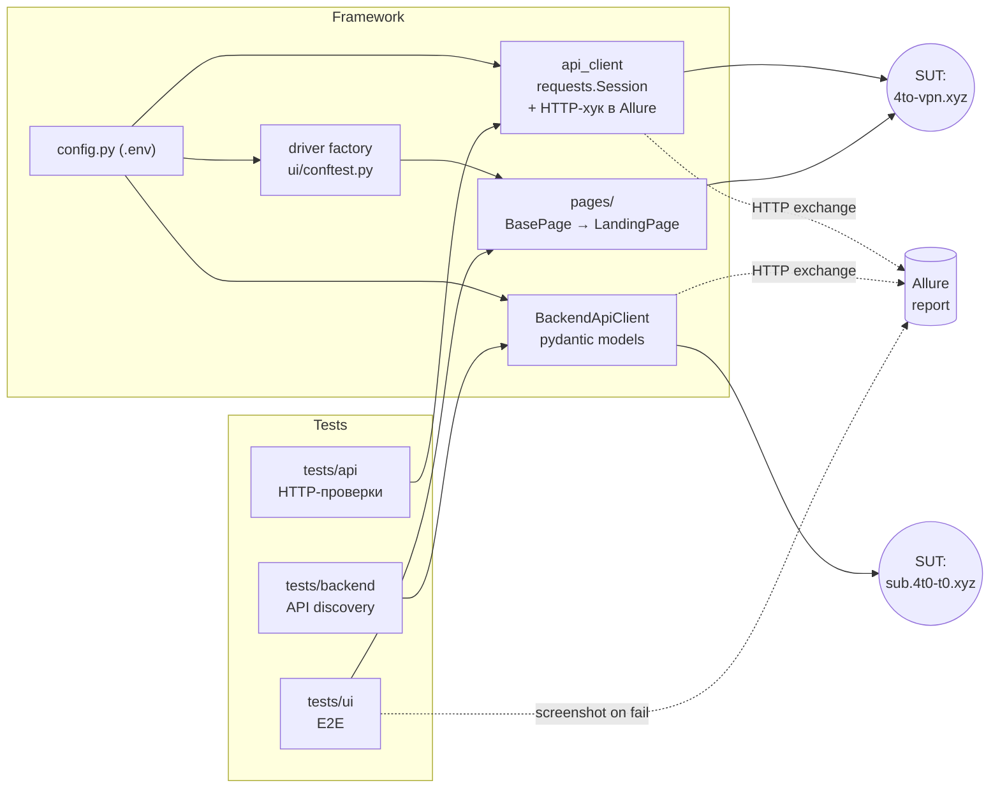
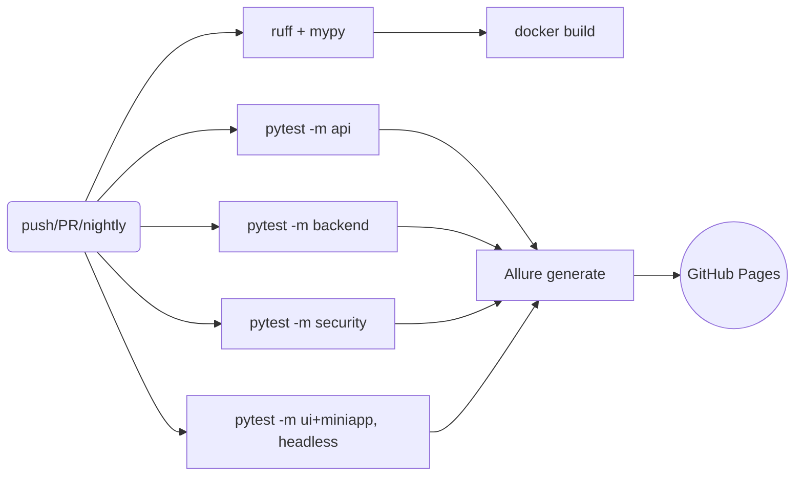

# 4to-VPN · AQA Framework

Автоматизированный тестовый фреймворк для веб-лендинга VPN-сервиса **4to VPN**
(`https://4to-vpn.xyz`): HTTP-проверки на `requests` + E2E на `selenium` с паттерном
**Page Object**, отчётность **Allure**, статический анализ **ruff/mypy**.

Проект заточен под реальный продукт (VPN-сервис с Telegram-ботом и Mini App),
не под абстрактную песочницу — включая сетевые реалии (DPI-фильтрация контента).


[](https://github.com/hakurai-cmd/4to-vpn-aqa/actions/workflows/tests.yml)
[](https://hakurai-cmd.github.io/4to-vpn-aqa/)

## Стек

| Слой | Инструмент |
|---|---|
| API-тесты лендинга | `requests` + `pytest` (параметризация, маркеры, фикстуры) |
| Backend API-тесты | `requests` + `pydantic` (схемы ответов) + типизированный `BackendApiClient` |
| UI-тесты | `selenium` (Firefox/Chrome), Page Object Model |
| Авторизация | изолированная `authed_client`-фикстура, `initData`-секрет в `.env` (не в git/CI) |
| Security/rate-limiting | `xfail`-документация дефектов, **санitизация секретов в Allure** перед публикацией |
| Отчётность | `allure-pytest` (шаги, severity, скриншоты при падении, HTTP-лог) |
| Линт/типы | `ruff` + `mypy`, `pre-commit` |
| Покрытие | `pytest-cov` |

## Архитектура



**Ключевые решения**

- **Backend API discovery**: документации бэкенда не было. Контракт ручек (`/api/auth`, `/api/user`, `/api/device_sub`, `/api/sbp`, `/api/invoice`, `/api/withdraw`) восстановлен из inline-JavaScript сохранённой страницы Mini App. Схемы ответов — `pydantic` в `models/backend.py`, клиент — `clients/backend_client.py`.
- **Слоистые conftest**: корневой держит общую фикстуру `api_client`, `tests/ui/conftest.py` — браузерную, `tests/backend/conftest.py` — backend-клиент. UI-тесты не запускают Firefox.
- **Page Object**: тесты на бизнес-языке (`page.is_telegram_link_visible()`), локаторы — в одном файле `pages/landing_page.py`.
- **Стабильные локаторы**: по `href`-роутам и тегам, а не по CSS-классам с хешами (`HeroSection-module__YGMWTW__...`), которые меняются при каждой сборке фронта.
- **Явные ожидания**: только `WebDriverWait` + `expected_conditions`, без implicit waits.
- **Environment-виджет и HTTP-логи в Allure**: при падении API-теста в отчёт уходит curl-подобный блок «запрос→ответ».

## Структура

```
vpn_aqa_framework/
├── config.py                  # конфиг из .env (URL, API, браузер, initData, timeout, прокси)
├── conftest.py                # api_client + allure-хук HTTP + env-виджет
├── pytest.ini                 # маркеры api/backend/ui, addopts (alluredir)
├── pyproject.toml             # ruff, mypy, coverage
├── .pre-commit-config.yaml    # ruff + mypy на каждый коммит
├── requirements.txt           # runtime-зависимости
├── requirements-dev.txt       # dev-инструменты (ruff, mypy, cov, pre-commit)
├── clients/
│   └── backend_client.py      # типизированный клиент backend API
├── models/
│   └── backend.py             # pydantic-схемы ответов
├── pages/
│   ├── base_page.py           # BasePage: явные ожидания, find/click/is_visible
│   └── landing_page.py        # локаторы и методы лендинга
└── tests/
    ├── api/test_web_landing.py    # 6 HTTP-тестов лендинга
    ├── backend/                   # 10 тестов backend API (API discovery)
    │   ├── conftest.py
    │   ├── test_auth.py
    │   ├── test_user.py
    │   ├── test_device_sub.py
    │   ├── test_payments.py
    │   └── test_withdrawal.py
    └── ui/
        ├── conftest.py            # фабрика драйвера + скриншот при падении
        └── test_landing_ui.py     # 7 E2E-тестов
```

## Установка

```bash
git clone <repo> && cd vpn_aqa_framework
python3.12 -m venv .venv && source .venv/bin/activate
pip install -r requirements-dev.txt
cp .env.example .env   # при необходимости вписать PROXY_URL
```

## Запуск

```bash
# Все тесты
pytest

# Только API лендинга / backend / UI лендинга / Mini App / security
pytest -m api
pytest -m backend
pytest -m ui
pytest -m miniapp
pytest -m security

# С покрытием
pytest --cov --cov-report=term-missing

# Посмотреть Allure-отчёт
allure serve allure-results
```

### В Docker (портативно, без установки Python/браузеров)

```bash
docker build -t 4to-vpn-aqa .
docker run --rm 4to-vpn-aqa                       # все тесты
docker run --rm 4to-vpn-aqa pytest -m api         # только API
```

### Линтеры и типы

```bash
ruff check . && ruff format --check .
mypy
```

## Конфигурация (`.env`)

| Переменная | По умолчанию | Описание |
|---|---|---|
| `WEB_URL` | `https://4to-vpn.xyz` | Базовый URL лендинга |
| `TIMEOUT` | `10` | Таймаут запроса/ожидания, сек |
| `PROXY_URL` | — | HTTPS-прокси (если SUT недоступен напрямую) |
| `BROWSER` | `firefox` | `firefox` или `chrome` |
| `HEADLESS` | `true` | Запуск браузера без GUI |

> **Особенность окружения.** С машины разработчика (RU, без VPN) сайт
> частично режется по SNI: заголовки и редиректы доходят, полное тело HTML —
> нет. Поэтому для боевого прогона нужен `PROXY_URL` или системный VPN.
> UI-тесты можно прогнать офлайн по сохранённому снимку страницы:
> `WEB_URL="file://$PWD/4to-vpn.xyz.html" pytest -m ui`.

## CI/CD

Пайплайн `.github/workflows/tests.yml` — на каждый пуш, PR и ночной прогон (`0 3 * * *`).
`concurrency` отменяет устаревший запуск при новом пуше в ту же ветку.



| Job | Что делает |
|---|---|
| `lint` | `ruff check`, `ruff format --check`, `mypy` — чистота кода |
| `api` | HTTP-тесты лендинга, артефакт `allure-results-api` |
| `backend` | Backend API (6 ручек), API discovery из Mini App, артефакт `allure-results-backend` |
| `security` | Security-заголовки + rate-limit; найденные дефекты помечены `xfail` (зелёный CI, документация в Allure) |
| `ui` | E2E на headless Firefox (браузер из образа runner'а), артефакт `allure-results-ui` |
| `report` | Сливает артефакты, генерирует единый Allure-отчёт, деплоит в GH Pages (официальный `deploy-pages`) → `https://<owner>.github.io/<repo>/` |
| `docker-build` | Проверяет сборку `Dockerfile` — портативность подтверждена на CI, а не «у меня работает» |

> Для деплоя Allure в GH Pages на репозитории нужно включить **Settings → Pages →
> Source: GitHub Actions**. SUT при запусках из GitHub runner'а (US/EU) доступен
> без прокси — DPI-фильтрация, влияющая на локальные прогоны, в CI не проявляется.

## Roadmap

- [x] API-фундамент (requests, pytest, конфиг, параметризованные проверки)
- [x] UI-слой лендинга (Selenium, Page Object, мобильный вьюпорт)
- [x] Telegram Mini App UI (10 E2E, mobile SPA)
- [x] Backend API: типизированный клиент + pydantic-схемы (API discovery из Mini App)
- [x] Unit-тесты клиента с моками (`responses`) — тест-пирамида
- [x] Security-тесты: security-заголовки + брутфорс-защита (найденные дефекты — `xfail`)
- [x] IDOR-тесты: чужой uid Reject (403), защита подтверждена на live API
- [x] Allure (шаги, severity, скриншоты, HTTP-лог, env-виджет, **санitизация секретов**)
- [x] Линт/типы (ruff, mypy, pre-commit)
- [x] CI/CD: GitHub Actions + Docker (Allure в GitHub Pages, live-бейджи)
- [x] Backend happy-path: бизнес-флоу `auth → user → device_sub` на реальном `TELEGRAM_INIT_DATA`

## Лицензия

MIT